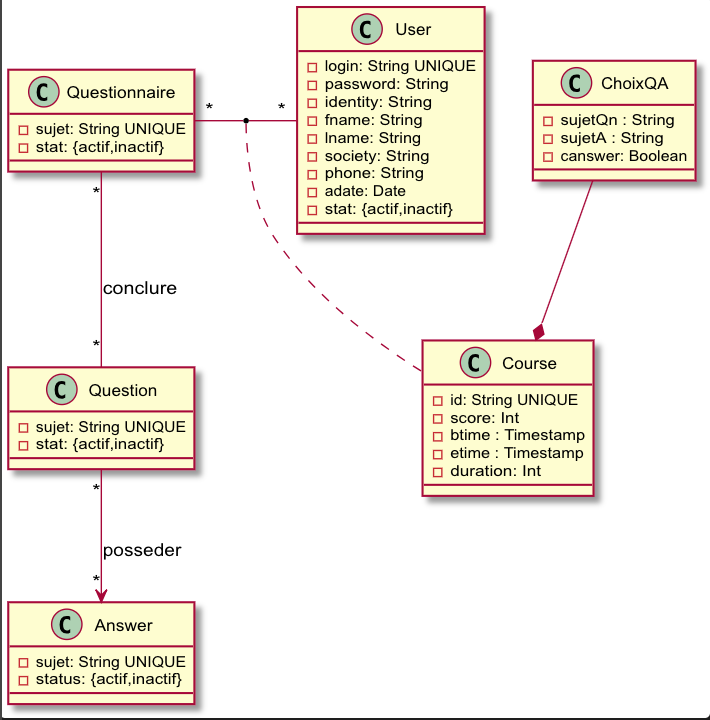
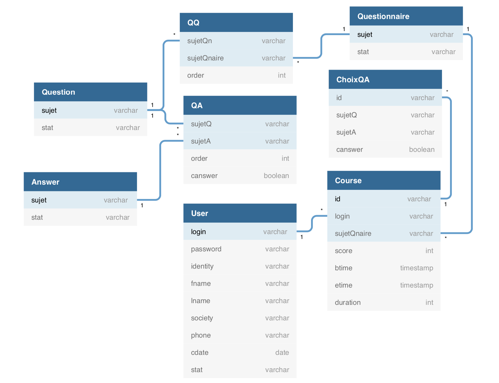
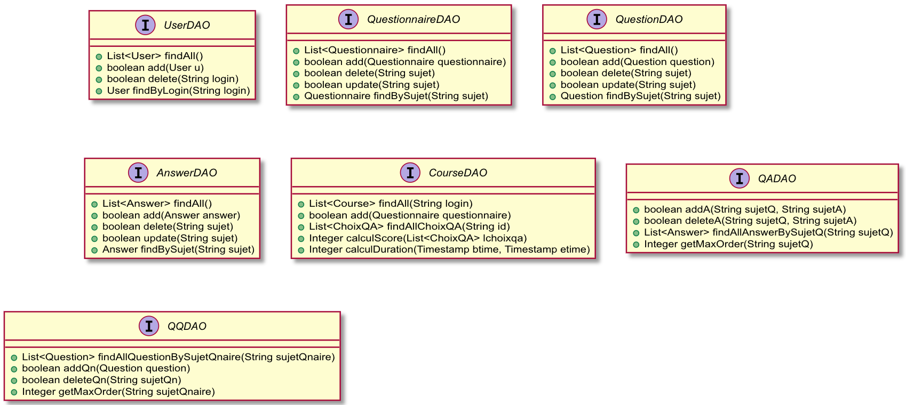
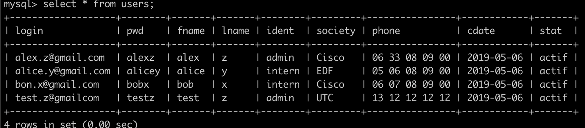
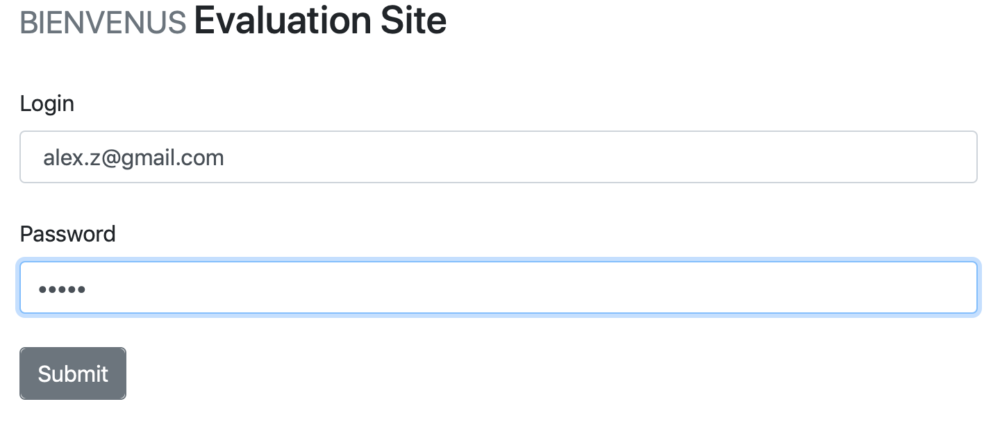
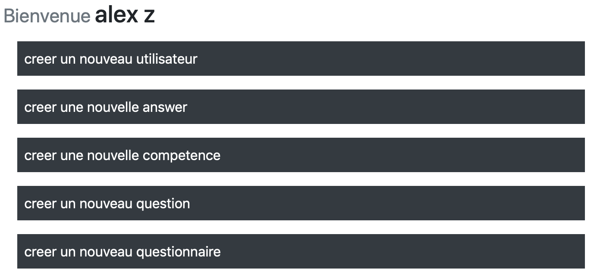

# sr03-MVC 

## P1 - devoir pour 07/05/2019

### Modélisation conceptuelle de données avec UML

#### Rappel  de description fonctionnelle

`« Utilisateur »` : Acteur pouvant accéder à la plate-forme d'évaluation des compétences. 
- Il existe 2 types d’utilisateurs : Administrateur et stagiaire. 
    - L'administrateur est le seul à créer des comptes. 
    - Le stagiaire recevra un email automatique notifiant sa création de compte. Ce dernier comportera ses identifiants (email/mot de passe généré) 
-  L'authentification s'effectue grâce à une adresse email et un mot de passe de 6 caractères minimum 
- Le compte d’un utilisateur comportera son nom, sa société, ses coordonnées téléphoniques, la date de création et le statut du compte (actif/inactif). 
- Libre à vous d'ajouter d'autres informations si besoin 


`« Questionnaire/Question/Réponse » `: 
- Un questionnaire est associé à une compétence spécifique 'sujet’ qui est unique (Développement Java, Webservices etc.). 
- Un questionnaire est composé de plusieurs questions. 
- Chaque question possède une liste de réponses possibles dont 1 seul qui est bonne: 1 bonne réponse parmi les réponses proposées
- 1 réponse possible est associée à 1 seule question 
- Toutes les entités (questionnaire/question/réponse) possède des statuts (actif/inactif) 
- L'administrateur est capable de changer l'ordre des questions dans un questionnaire ainsi que l'ordre des réponses possibles à une question 

`« Parcours »` Un parcours est la sauvegarde d'un déroulement d'une évaluation (passage d’un questionnaire) 
- Il stocke l’utilisateur, le questionnaire auquel ce dernier a répondu, son score, la durée du passage et les réponses formulées pour chaque question 
- Une bonne réponse à une question vaut 1 point A la fin d'un parcours, on affiche au stagiaire son score, la durée et les bonnes réponses 
- Un parcours est effectué en 1 seul passage (pas de pause, ni de sauvegarde de questions ou autre) 
- Une mauvaise réponse n’a aucun impact sur le score (0) 
- Lors du parcours, le stagiaire visualise une question à la fois avec les propositions de réponses (Sous forme de boutons radio). 
- Un bouton suivant mènera vers la question suivante. Séance 1 : 


#### Diagramme de classes

- `ChoixQA` est une classe de composition de la classe Course, qui sert à stocker les choix des réponses de chaque question dans la questionnaire. 




### Modélisation des données en SQL/JAVA	

- `QA`: La Classe QA est destiné à gérer Question et Answer. Le sujetQ et le sujetA sont les références étrangères. On ajoute ordre afin d’indiquer la position de réponse pour chaque question, et canswer qui signifie la réponse correcte indique si une réponse est bonne pour cette question. 

- `QQ`: La classe QQ sert à gérer Questionnaire et Question. 

- `Course & ChoixQA`: On ajoute dans la classe course un key artificiel pour joindre Course et ChoixQA. Lorsque le stagiaire est en train de répondre une questionnaire,  les 3 attributs dans ChoixQA (sujetQ, sujetA, canswer) sont directement obtenu en fonction de la classe QA, et le sujetA ne stocke que la réponse choisit par le stagiaire. Du coup si canswer est true, on sait que la réponse que le stagiaire choisit est correcte.



### Interface de DAO

Les interfaces de DAO définissent tous les traitements entre JAVA et SQL. Leurs implémentations sont placés dans autres java files. La modification est possible lorsque qu’on avance le projet.

- `CourseDAO`:  Puisque la classe ChoixQA est une composition de la classe Course, on met en oeuvre un seul DAO pour cettes deux classes.




### Exemple de Réalisation - Classe User

#### Structure du projet	

La structure simplifié concernant l’exemple:

    src
    |--dao
    |   |--UserDAO.java  
    |   |--UserDAOImpl.java
    |--model
    |   |--User.java 
    |--util
    |   |--dbConfig.properties
    |   |--ConnSQL.java


#### Codes de classe User

<User.java>

```java
    public class User {
        private String login;
        ...
        public User() {	
        }
        
        public User(String login, String pwd, String fname, String lname, 
                String identity, String society, String phone, Date cdate, String stat) {
            this.login = login;
            …...
        }
        
        // methods of get
        public String getLogin() {
            return login;
        }
        …...
        // methods of set
        public void setLogin(String login) {
            this.login = login;
        }
        …...
    }
```

#### Connexion entre JAVA et SQL	

<dbConfig.properties>

On crée un file afin de stocker les paramètres pour connecter SQL. Il est plus pratique pour la gestion.


    jdbc.url=jdbc:mysql://localhost/sr02
    jdbc.username=sr02
    jdbc.password=sr02sr02
    jdbc.driver=com.mysql.cj.jdbc.Driver

<ConnSQL.java>

La classe ConnSQL conclure deux fonctions principales: 
- connecter le sql 
- Déconnecter le sql

Il suffit d’appeler les deux fonctions lorsque le traitement.

```java
    public class ConnSQL {
        public static String URL;
        public static String USERNAME;
        public static String PASSWORD;
        public static String DRIVER;
        private static ResourceBundle rb = ResourceBundle.getBundle("util.dbConfig");
            
        private ConnSQL(){}
        
        // bind data
        static{
            URL = rb.getString("jdbc.url");
            USERNAME = rb.getString("jdbc.username");
            PASSWORD = rb.getString("jdbc.password");
            DRIVER = rb.getString("jdbc.driver");
            try {
                Class.forName(DRIVER);
            } catch (ClassNotFoundException e) {
                e.printStackTrace();
            }
        }
        // connection
        public static Connection getConnection(){
            Connection conn = null;
            try {
                conn = DriverManager.getConnection(URL, USERNAME, PASSWORD);
            } catch (SQLException e) {
                e.printStackTrace();
                System.out.println("Fail:connexion!");
            }
            return conn;
        }
        
        // disconnection
        public static void close(ResultSet rs,Statement stat,Connection conn){
                try {
                    if(rs!=null)rs.close();
                    if(stat!=null)stat.close();
                    if(conn!=null)conn.close();
                } catch (SQLException e) {
                    e.printStackTrace();
                }
        }
    }

```

#### Réalisation de DAO - Interface et implémentation

##### Interface de UserDAO

<UserDAO.java>
```java
    public interface UserDAO {
        public List<User> findAll() throws SQLException;
        public boolean add(User u) throws SQLException;
        public boolean delete(String login) throws SQLException;
        public User findByLogin(String login) throws SQLException;
    }
```

##### Implémentation de UserDAO - exemple sur findByLogin()

<UserDAOImpl.java>

```java
    public class UserDAOImpl implements UserDAO{
                …..
            @Override
        public User findByLogin(String login) throws SQLException{
            User u = new User();
            String sql = "select * from users where login = ?";
            Connection conn = null;
            PreparedStatement pstem = null;
            ResultSet res = null;
            try {	
                conn = ConnSQL.getConnection();
                        pstem = conn.prepareStatement(sql);
                        pstem.setString(1, login);
                res = pstem.executeQuery();
                System.out.println("UserDAOImpl.findByLogin()");
                if(res.next()){
                    u.setLogin(res.getString("login"));
                    u.setPwd(res.getString("pwd"));
                    u.setFname(res.getString("fname"));
                    u.setLname(res.getString("lname"));
                    u.setIdentity(res.getString("ident"));
                    u.setSociety(res.getString("society"));
                    u.setPhone(res.getString("phone"));
                    u.setCdate(res.getDate("cdate"));
                    u.setStat(res.getString("stat"));
                }
            }catch(SQLException e){
                e.printStackTrace();
                throw new SQLException("Echec:DELETE");
            }finally{
                ConnSQL.close(null,pstem,conn);
            }
                    ConnSQL.close(res,pstem,conn);
            return u;
        } 
            …...
    }
```

##### Teste findByLogin() par login dans le server




On utilise une compte d’administrateur pour tester: alex.z@gmail.com. 








## P2 - séance de validation au 21/05/2019

- L’évaluation va porter sur les fonctionnalités suivantes:
    - la création d'un nouveau utilisateur (stagiaire, admin)
    - Activer / désactiver un compte d'utilisateur
    - Afficher la liste des utilisateurs (avec l'état de compte) mais sans les fonctionnalité recherche, édition, et pagination

